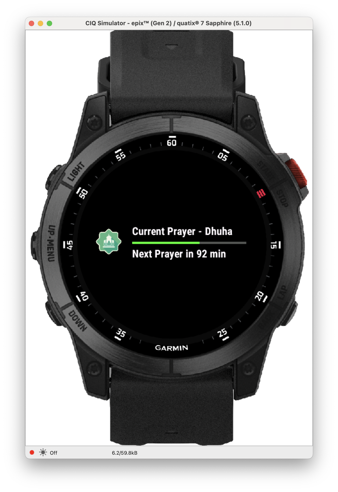
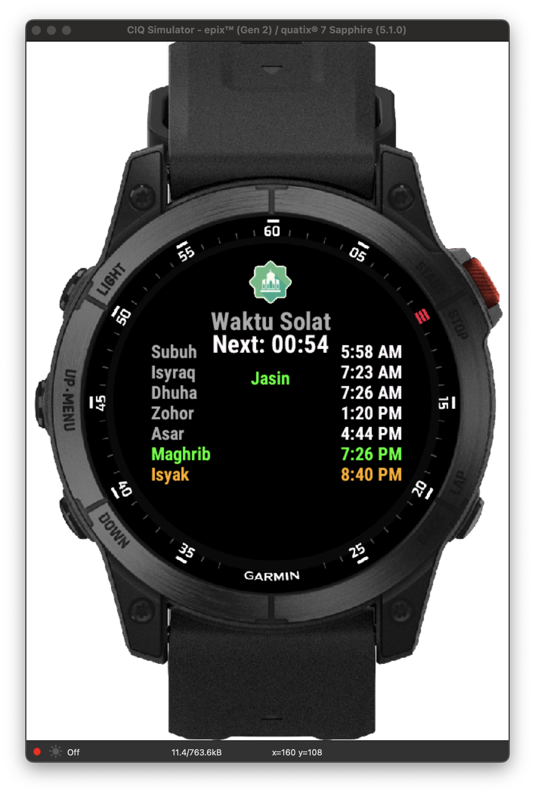

# Waktu Solat Malaysia Lite - ConnectIQ App

**Version 2.1.0** | A lightweight, battery-friendly Islamic prayer times app for Garmin watches with GPS and manual coordinate support**

[](https://github.com/salihinsaealal/waktu-solat-connectiq)
[](https://developer.garmin.com/connect-iq/)
[](LICENSE)
[](https://coff.ee/salihin)

## Screenshots

<div align="center">



</div>

> **Note**: This lightweight app fetches live prayer times from Malaysian API using GPS coordinates, with intelligent failsafes for users outside Malaysia, manual coordinate fallback, and mock data for testing.

## Why "Lite"?

**Waktu Solat Malaysia Lite** is designed for **maximum battery efficiency** and **minimal resource usage**:

- **Ultra-lightweight code** - Optimized for minimal power consumption
- **Smart caching** - Intelligent API fetch intervals (2 minutes if location unchanged, immediate if location changes)
- **Efficient UI** - Clean design that doesn't drain your watch
- **Intelligent failsafes** - Works reliably without constant GPS polling
- **Perfect for all-day wear** - Won't impact your watch's battery life
- **Enhanced loading feedback** - Current prayer remains highlighted during data refresh

**Geographic Failsafe**: If you're traveling outside Malaysia, the app automatically uses default Malaysian coordinates to ensure you still get prayer times.

---

## What This App Does

### **Main App**
- **Logo at the top** - Shows the app icon
- **Time countdown** - Shows how much time left until next prayer (HH:MM format)
- **Location display** - Shows your current location with data source indicator
- **Visual Status Indicator**

A small colored circle appears above the location text to indicate the current data source:

- **Green Circle**: Fresh API data (updated within 2 hours)
- **Yellow Circle**: Cached API data (2-24 hours old)
- **Blue Circle**: Manual coordinates are active
- **Gray Circle**: Using mock/fallback data

This provides immediate visual feedback about your data source status and data freshness.
- **Prayer times** - All times shown in 12-hour format with AM/PM
- **Color coding** - Easy to see which prayer is which
  - **Green**: The prayer time you're in now
  - **Yellow**: The next prayer coming up
  - **Gray**: Other prayer times
- **Menu access** - Press menu button for Settings and Refresh options
- **Scroll to see all** - You can scroll up and down to see all prayers
- **Clean design** - Simple and easy to read interface

### **Settings Page**
- **Manual coordinates** - Set latitude and longitude manually
- **GPS/Manual toggle** - Switch between automatic GPS and manual mode
- **Current status** - View active coordinates and data source mode
- **API testing** - Test API calls with current coordinates
- **Input validation** - Ensures only valid coordinates are accepted
- **Easy navigation** - Access via main menu, return to app easily

### **Glance Menu**
- **Color-coded progress bar** - Shows time progress to next prayer
  - **Green**: Normal time remaining
  - **Yellow**: Less than 20% time left
  - **Red**: Less than 10 minutes remaining
- **Current prayer info** - Shows active prayer period
- **Next prayer countdown** - Time remaining until next prayer
- **Always updated** - Displays cached data from main app for battery efficiency
- **Ratio-based positioning** - Optimized layout scaling for different device sizes (Epix 2 analyzed)

### **Prayer Times Included**
1. **Subuh** (Fajr) - Dawn prayer
2. **Isyraq** - Sunrise prayer
3. **Dhuha** - Mid-morning prayer
4. **Zohor** (Dhuhr) - Midday prayer
5. **Asar** (Asr) - Afternoon prayer
6. **Maghrib** - Sunset prayer
7. **Isyak** (Isha) - Night prayer

---

## Device Compatibility

### Supported Devices

**Multi-Device Support with Responsive Layout:**
- **Epix 2 (416x416)**: Primary baseline for responsive calculations
- **Forerunner 255/255M/255S/255SM (260x260)**: Scaled layout with device-specific optimizations
- **Venu 2S (360x360)**: Responsive scaling from Epix 2 baseline
- **Fenix 6/6 Pro/6S/6S Pro**: Full compatibility with responsive layout
- **Edge 1040**: Cycling computer support with adapted interface

**Responsive Design Features:**
- Automatic scaling based on screen dimensions
- Font-height-aware positioning for consistent appearance
- Percentage-based margins and spacing for universal compatibility
- Generic calculation approach works across all supported devices

---
**Requirements:**
- Connect IQ API Level 3.1.0 or higher
- GPS and Communications permissions
- Internet connectivity for live prayer times API (optional)
- **GPS capability** - For automatic location detection (optional)

## API Configuration

**IMPORTANT**: This app requires you to configure your own prayer times API endpoint.

### Setting Up Your API

1. **Find a Prayer Times API Service**
   - The app is designed to work with REST APIs that accept latitude/longitude coordinates
   - API should return prayer times in JSON format
   - Example API format: `YOUR_API_ENDPOINT/lat,lon`

2. **Configure the API Endpoint**
   - Edit `source/PrayerDataManager.mc` line ~216
   - Edit `source/PrayerBackgroundService.mc` line ~139
   - Replace `YOUR_API_ENDPOINT_HERE` with your actual API URL

3. **API Response Format**
   - The app expects JSON response with prayer time fields
   - Modify the parsing logic in `PrayerDataManager.mc` if needed to match your API's response format

**Note**: The original developer does not own or provide the prayer times API service. Users are responsible for finding and configuring their own API endpoint.

### Steps to Install

1. **Download the code**
   ```bash
   git clone https://github.com/salihinsaealal/waktu-solat-connectiq.git
   cd waktu-solat-connectiq
   ```

2. **Build the app**
   ```bash
   monkeyc -f monkey.jungle -d epix2 -o bin/waktu_solat.prg -y developer_key
   ```

3. **Install on your watch**
   ```bash
   monkeydo bin/waktu_solat.prg epix2
   ```

4. **Grant permissions** (on first launch)
   - Allow GPS/Location access for automatic coordinates
   - Allow Internet access for live prayer time API

### First Time Setup

**Option 1: Automatic (Recommended)**
- App will use GPS to detect your location
- Prayer times fetched automatically from API
- Green status indicator shows live data

**Option 2: Manual Setup**
- Go to Menu → Settings
- Enter your latitude and longitude manually
- Toggle to "Manual" mode
- Blue status indicator shows manual coordinates

## Data Sources

The app uses multiple data sources with automatic fallback:

1. **Live API Data** (Primary)
   - Fetches prayer times from a third-party prayer times API service
   - **Note**: The API service is NOT owned by the app developer
   - Users must configure their own API endpoint in the app settings
   - Uses GPS coordinates or manual coordinates
   - Updates automatically every 15 minutes
   - Indicated by green status circle

2. **Manual Coordinates** (Fallback)
   - User-set latitude/longitude via Settings
   - Used when GPS fails or is disabled
   - Indicated by blue status circle

3. **Mock Data** (Last Resort)
   - Default prayer times for Jasin, Malaysia
   - Used when no coordinates available
   - Indicated by gray status circle

---

## Customization

> **Want to customize the app?** Check out our comprehensive [**CUSTOMIZATION_GUIDE.md**](CUSTOMIZATION_GUIDE.md)

### Quick Customizations

#### **Change Default Mock Data**
Edit the mock data in `/source/PrayerDataManager.mc`:
```monkey-c
var mockPrayerTimes = {
    "Subuh" => "05:58",    // Change to your local times
    "Syuruk" => "07:11",
    "Isyraq" => "07:23",
    "Dhuha" => "07:26",
    "Zohor" => "13:20",
    "Asar" => "16:44",
    "Maghrib" => "19:26",
    "Isyak" => "20:40"
};
```

#### **Change Default Location**
Update the default location in PrayerDataManager:
```monkey-c
Storage.setValue(LOCATION_KEY, "Your City"); // Change from "Jasin"
```

#### **Adjust Visual Elements**
Modify colors and UI elements in the main view:
```monkey-c
// Status indicator colors
indicatorColor = Graphics.COLOR_GREEN;  // API data
indicatorColor = Graphics.COLOR_BLUE;   // Manual coordinates
indicatorColor = Graphics.COLOR_LT_GRAY; // Mock data

// Prayer time colors
prayerColor = Graphics.COLOR_GREEN;  // Current prayer
prayerColor = Graphics.COLOR_YELLOW; // Next prayer
```

#### **Manual Coordinate Setup**
Users can set coordinates via the Settings page:
1. Open app menu
2. Select "Settings"
3. Choose "Set Latitude" and "Set Longitude"
4. Toggle to "Manual" mode

---

## Project Structure

```
waktuSolatHomeAssistant/
├── README.md                    # This file
├── CUSTOMIZATION_GUIDE.md       # Detailed customization guide
├── .gitignore                   # Git ignore rules
├── manifest.xml                 # App manifest
├── monkey.jungle                # Build configuration
├── source/                      # Source code
│   ├── waktuSolatHomeAssistantApp.mc         # Main app class
│   ├── waktuSolatHomeAssistantView.mc        # Main view (UI)
│   ├── waktuSolatHomeAssistantDelegate.mc    # Input handling
│   ├── waktuSolatHomeAssistantMenuDelegate.mc # Menu handling
│   ├── waktuSolatGlanceView.mc               # Glance view
│   ├── waktuSolatSettingsView.mc             # Settings page
│   └── PrayerDataManager.mc                  # Data management
├── resources/                   # App resources
│   ├── drawables/              # Images and icons
│   │   ├── drawables.xml       # Drawable definitions
│   │   └── waktu_solat_small.png # App logo
│   ├── layouts/                # UI layouts
│   │   └── layout.xml          # Main layout
│   ├── menus/                  # Menu definitions
│   │   └── menu.xml            # App menu structure
│   └── strings/                # Text resources
│       └── strings.xml         # String definitions
└── bin/                        # Build output (ignored by git)
```

---

## Development

### Building from Source

1. **Install Garmin ConnectIQ SDK**
   - Download from [Garmin Developer Portal](https://developer.garmin.com/connect-iq/sdk/)
   - Follow installation instructions for your OS

2. **Generate Developer Key**
   ```bash
   openssl genrsa -out developer_key 4096
   openssl pkcs8 -topk8 -inform PEM -outform DER -in developer_key -out developer_key.der -nocrypt
   ```

3. **Build Commands**
   ```bash
   # Build for epix2
   monkeyc -f monkey.jungle -d epix2 -o bin/waktu_solat_epix2.prg -y developer_key
   
   # Test on simulator
   monkeydo bin/waktu_solat_epix2.prg epix2
   
   # Build for other devices (replace 'epix2' with target device)
   monkeyc -f monkey.jungle -d vivoactive4 -o bin/waktu_solat_va4.prg -y developer_key
   ```

### Code Architecture

- **Main App (`waktuSolatHomeAssistantApp.mc`)** - App initialization and lifecycle
- **Main View (`waktuSolatHomeAssistantView.mc`)** - Primary UI with prayer times
- **Delegate (`waktuSolatHomeAssistantDelegate.mc`)** - Input handling (scrolling, menu)
- **Glance View (`waktuSolatGlanceView.mc`)** - Quick glance widget

---

## Recent Improvements (v2.1.0)

### Enhanced User Experience
- **Improved Loading State**: During API data refresh, the current prayer time remains highlighted in green instead of all prayers turning gray, providing better visual feedback
- **Smarter API Fetching**: Reduced API fetch interval from 15 minutes to 2 minutes when coordinates remain unchanged, with immediate fetching when location changes
- **Enhanced Glance View**: Added ratio-based positioning analysis for better scalability across different device sizes

### Technical Improvements
- **Coordinate Change Detection**: Implemented intelligent coordinate tracking that triggers immediate API refresh when location changes by more than 0.001 degrees (~100m)
- **Battery Optimization**: API fetching only occurs when user opens the app or glance view, not in background
- **ConnectIQ Compliance**: Glance view properly handles platform API restrictions by using cached data only
- **Error Handling**: Enhanced error handling and fallback mechanisms for better reliability

### Developer Notes
- **Glance View Limitations**: ConnectIQ platform restricts API calls (like `Communications.makeWebRequest`) in glance views. Any attempt results in "Class not available to 'Glance'" errors. The correct approach is to cache data in the main app and read it in the glance view.
- **Ratio-based UI**: Glance view now logs positioning ratios for Epix 2 (274x103 area) to enable future scalable UI implementations
- **Coordinate Management**: Added helper functions for coordinate comparison and change detection with configurable sensitivity

---

## Roadmap

### Completed Features (v2.1.0)
- Real Prayer Time API integration
- GPS and manual coordinate support
- Smart caching and battery optimization
- Enhanced loading states and user feedback
- Glance view with progress indicators
- Settings menu with coordinate management
- Multi-device compatibility

### Future Features (v2.2+)
- **Multiple Calculation Methods** - MWL, ISNA, Egypt, etc.
- **Prayer Notifications** - Customizable alerts
- **Qibla Direction** - Compass pointing to Mecca
- **Islamic Calendar** - Hijri date display
- **Multi-language Support** - Arabic, Malay, English
- **Ratio-based UI Scaling** - Dynamic positioning for all device sizes

---

## Contributing

We welcome contributions! Here's how you can help:

1. **Fork the repository**
2. **Create a feature branch** (`git checkout -b feature/amazing-feature`)
3. **Commit your changes** (`git commit -m 'Add amazing feature'`)
4. **Push to the branch** (`git push origin feature/amazing-feature`)
5. **Open a Pull Request**

### Contribution Guidelines
- Follow existing code style and conventions
- Test on multiple devices if possible
- Update documentation for new features
- Add comments for complex logic

---

## License

This project is licensed under the MIT License - see the [LICENSE](LICENSE) file for details.

---

## Acknowledgments

- **Islamic Community** - For guidance on prayer time requirements
- **Garmin** - For the ConnectIQ platform
- **Contributors** - Everyone who helped improve this app

---

## Support

- **Issues**: [GitHub Issues](https://github.com/salihinsaealal/waktu-solat-connectiq/issues)
- **Discussions**: [GitHub Discussions](https://github.com/salihinsaealal/waktu-solat-connectiq/discussions)
<!-- - **Email**: your-email@example.com -->

---

<div align="center">

**Made with love for the Muslim community**

*May this app help you maintain your daily prayers*

[](https://github.com/salihinsaealal/waktu-solat-connectiq)

</div>
